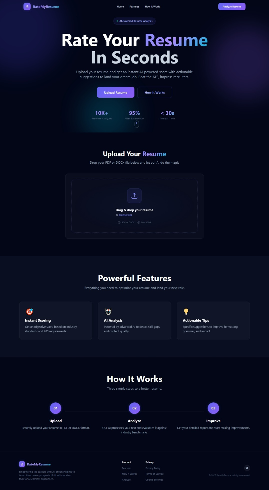
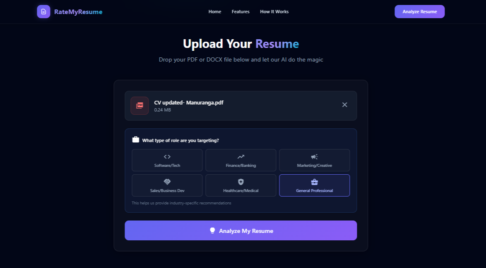
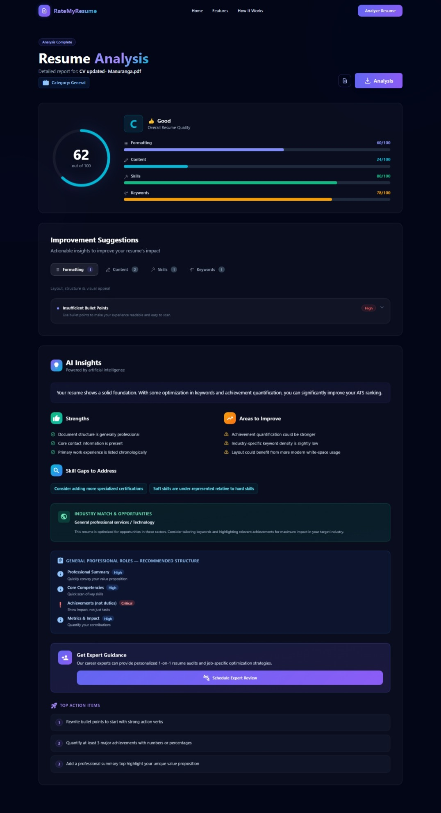
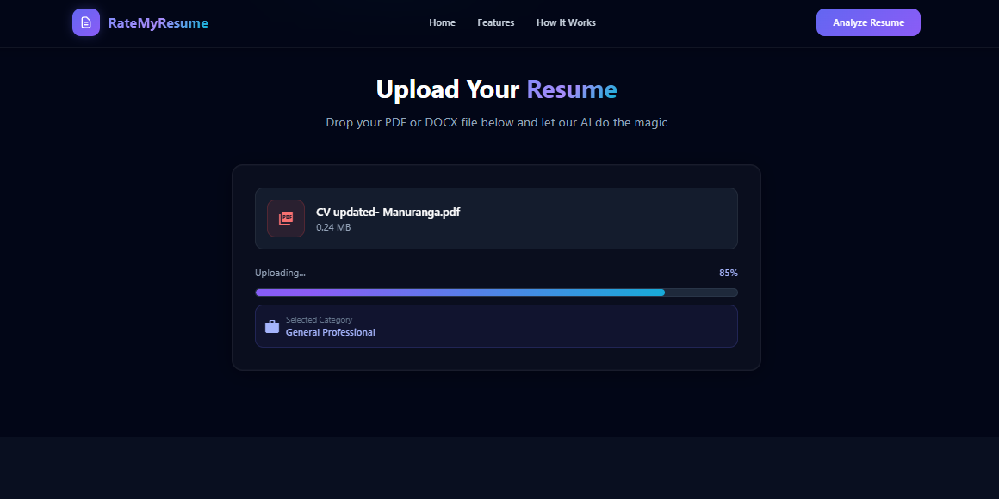
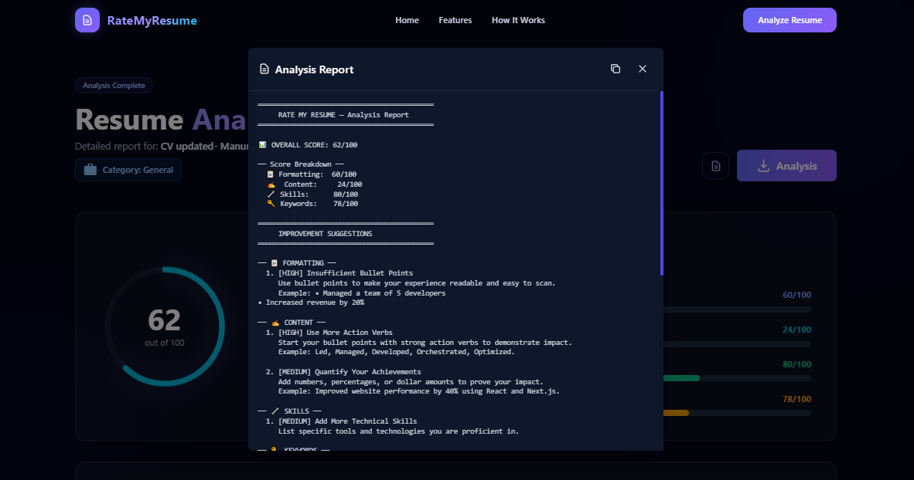

<h1 align="center">Resume Scaler</h1>
<h3 align="center">ATS Resume Analyzer • Optimization Suggestions • Clean UI</h3>

<p align="center">
Resume Scaler is a modern web application that helps users analyze and optimize their resumes for better
ATS (Applicant Tracking System) performance. It provides structured feedback on formatting, keyword usage,
and overall resume quality to improve job application success rates.
</p>

<p align="center">
  <a href="#overview">Overview</a> •
  <a href="#features">Features</a> •
  <a href="#tech-stack">Tech Stack</a> •
  <a href="#installation">Installation</a> •
  <a href="#live-demo">Live Demo</a> •
  <a href="#screenshots">Screenshots</a>
</p>

---

<p align="center">
  
  
  
  
  
</p>

---

## Overview

Resume Scaler is designed to assist job seekers by analyzing resumes and generating ATS-friendly improvement suggestions.
The goal is to ensure resumes are structured correctly, include relevant keywords, and follow professional formatting standards.

The application provides a clean interface where users can upload their resume, view scoring results, and receive instant feedback.

---

## Features

- Resume upload and analysis workflow
- ATS compatibility scoring system
- Keyword optimization suggestions
- Resume formatting and structure feedback
- Clean and modern UI for better user experience
- Fast analysis results with report generation

---

## Tech Stack

<p align="left">
  
</p>

### Core Technologies
- **Next.js** (React framework)
- **React** (Frontend UI)
- **Tailwind CSS** (Styling and responsive layout)
- **Node.js** (Runtime environment)

### Tools & Development
- **npm** (Package management)
- **ESLint** (Code quality)
- **Git / GitHub** (Version control)

### Deployment
- **Vercel / Netlify** (Recommended hosting platforms)

---

## Live Demo

(Coming Soon)  
Replace with your deployed link:

```

[https://your-vercel-or-netlify-link-here](https://your-vercel-or-netlify-link-here)

````

---

## Installation

### 1. Clone the repository
```bash
git clone https://github.com/shanirayuran-commits/resume-scaler.git
cd resume-scaler
````

### 2. Install dependencies

```bash
npm install
```

### 3. Run the project locally

```bash
npm run dev
```

Then open:

```
http://localhost:3000
```

---

## Screenshots

<details>
  <summary><b>Click to View Screenshots</b></summary>

  <br>

  <p align="center">
    
  </p>
  <p align="center"><i>Home Page</i></p>

  <br>

  <p align="center">
    
  </p>
  <p align="center"><i>Resume Upload</i></p>

  <br>

  <p align="center">
    
  </p>
  <p align="center"><i>ATS Analysis Results</i></p>

  <br>

  <p align="center">
    
  </p>
  <p align="center"><i>Processing / Analysing Screen</i></p>

  <br>

  <p align="center">
    
  </p>
  <p align="center"><i>Final Report</i></p>

</details>

---

## License

This project is licensed under the **MIT License**.
